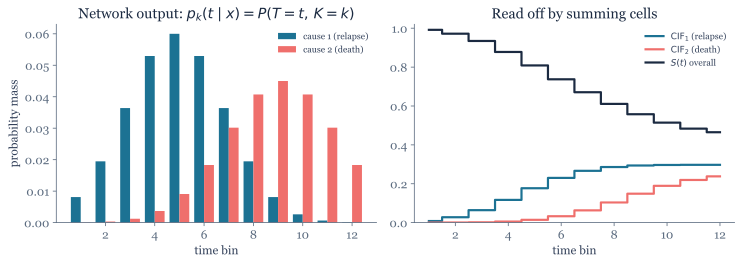

# DeepHit Loss

DeepHit (Lee et al., 2018) is a deep-learning survival model that does not require
the proportional-hazards assumption of Cox ([`2.1`](2.1_cox_ph_loss.md)) or a named
parametric event-time distribution ([`2.2`](2.2_negative_log_likelihood_loss.md)).
Instead, it predicts a discrete probability table and handles **competing risks**
([`1.4`](../01_background/1.4_multi_events_and_competing_risks.md)) natively. Its
loss combines a likelihood term that rewards probabilistic accuracy with a ranking
term that rewards discrimination. It is flexible, but not assumption-free: time
discretization, network architecture, and censoring assumptions still matter.

## Model output

Cox and parametric models predict a *summary* (a risk score, or a distribution's parameters) and reconstruct the survival curve afterward. DeepHit skips the middle-man: the network outputs the full **joint probability mass** over *which* event happens and *when*.

Time is first chopped into bins $t \in \{1, \dots, T_\max\}$ (the same discretization as the discrete-time NLL models in [`2.2`](2.2_negative_log_likelihood_loss.md)), and for each patient the network emits one probability per (event type, time bin) cell:

$$
\underbrace{p_k(t \mid x)}_{\text{prob. that event } k \text{ strikes in bin } t}
\;=\; P(T = t,\; K = k \mid x)
$$

- **$t$** — a discrete time bin.
- **$k \in \{1, \dots, K\}$** — the event *type* (cause), e.g. $k=1$ relapse, $k=2$ death. With a single event type, $K = 1$.
- All cells sum to at most 1; the leftover mass is the probability of never experiencing any event within the observed horizon.

Two quantities are read off this table by **summing cells** — no extra model needed:

$$
\underbrace{F_k(t \mid x)}_{\text{CIF for cause } k}
= \sum_{\tau \le t} p_k(\tau \mid x),
\qquad
\underbrace{S(t \mid x)}_{\text{event-free survival}}
= 1 - \sum_{k=1}^{K}\sum_{\tau \le t} p_k(\tau \mid x)
$$

$F_k$ is the **cumulative incidence function** — the probability of having had cause $k$ by time $t$, the competing-risks quantity defined in [`1.4`](../01_background/1.4_multi_events_and_competing_risks.md). $S$ is the probability of escaping *all* causes through $t$.

> **Worked example — one patient's table.** With two causes (relapse, death) and monthly bins, the network might place $0.04$ on (relapse, month 6) and $0.01$ on (death, month 6). Then the relapse CIF $F_1(6)$ is the sum of all relapse cells up to month 6, and $S(6)$ is $1$ minus *every* cell (both causes) up to month 6.

{fig-alt="Left: grouped bar chart of probability mass for two causes across time bins. Right: cumulative incidence step curves for the two causes plus a descending event-free survival curve."}

## From data to loss

DeepHit is trained by minimizing a **weighted sum of two losses**. Using separate
non-negative weights avoids ambiguity across implementations:

$$
\underbrace{L}_{\text{total}} \;=\; a\,
\underbrace{L_{\text{likelihood}}}_{\text{probabilistic accuracy}}
\;+\; b\,
\underbrace{L_{\text{rank}}}_{\text{discrimination}}
$$

The ratio $a:b$ controls the trade-off. The `pycox` API later uses a parameter named
`alpha`, but defines it specifically as $a=\alpha$ and $b=1-\alpha$.

### Term 1 — the likelihood loss (probabilistic accuracy)

This is the **same negative-log-likelihood recipe as [`2.2`](2.2_negative_log_likelihood_loss.md)** — product of per-subject likelihoods, log, negate — with one change: an *observed event* contributes the probability **mass** of its specific (time, cause) cell instead of a density, because time is now discrete.

$$
L_{\text{likelihood}} \;=\; -\sum_i \Big[\,
\underbrace{\delta_i \,\log p_{k_i}(T_i \mid x_i)}_{\text{event of type } k_i \text{ in bin } T_i}
\;+\;
\underbrace{(1-\delta_i)\,\log S(T_i \mid x_i)}_{\text{censored: survived past } T_i}
\,\Big]
$$

where $\delta_i$ is the event indicator (1 = event seen, 0 = censored) and $k_i$ is subject $i$'s event type. The switch is identical to [`2.2`](2.2_negative_log_likelihood_loss.md#the-likelihood): a patient who had the event is scored by the cell they landed in; a censored patient is scored by the probability of having survived as long as they did.

### Term 2 — the ranking loss (discrimination)

The likelihood term rewards accurate probabilities but does not guarantee calibration
in finite data or directly emphasize the **ordering** of patients—which is what the
[C-index](../03_metrics/3.1_c_index.md) measures. The ranking term adds that pressure
with a smooth, differentiable penalty over **comparable pairs**.

A pair $(i, j)$ is *comparable for cause $k$* when patient $i$ actually had event $k$ at time $T_i$ while patient $j$ was still event-free at that moment ($T_j > T_i$). For such a pair, the patient who failed should have the **higher predicted incidence** at $T_i$: $F_k(T_i \mid x_i) > F_k(T_i \mid x_j)$. The loss penalizes violations:

$$
L_{\text{rank}} \;=\; \sum_{k=1}^{K}\;\sum_{(i,j)\,\in\,\mathcal{A}_k}\;
\underbrace{\exp\!\left(-\frac{F_k(T_i \mid x_i) - F_k(T_i \mid x_j)}{\sigma}\right)}_{\text{small when } i \text{ correctly ranked above } j;\ \text{large when not}}
$$

- **$\mathcal{A}_k = \{(i,j) : \delta_i = 1,\; k_i = k,\; T_j > T_i\}$** — the acceptable (comparable) pairs for cause $k$.
- **$\sigma$** (sigma) — a scale controlling how sharply the penalty reacts to the CIF gap. Smaller $\sigma$ → steeper penalty for mis-ordered pairs.
- Because we *minimize* $L_{\text{rank}}$, the exponential drives the gap $F_k(T_i \mid x_i) - F_k(T_i \mid x_j)$ to be **large and positive** — exactly the concordant ordering the C-index rewards.

> **Worked example — one ranking pair.** Patient A relapses at month 6; patient B is still relapse-free at month 6 (so $T_B > 6$). This is a comparable pair for the relapse cause. DeepHit wants $F_1(6 \mid x_A) > F_1(6 \mid x_B)$ — A's predicted relapse incidence at month 6 above B's. If the model instead predicts B as the higher-risk one, the gap goes negative and the $\exp(\cdot)$ penalty blows up, pushing the network to fix the ordering.

### Combined

$$
L \;=\; a\,L_{\text{likelihood}} \;+\; b\,L_{\text{rank}}
$$

For the `pycox` convention, this becomes
$L=\alpha L_{\text{likelihood}}+(1-\alpha)L_{\text{rank}}$.

Probabilistic accuracy and discrimination can pull in different directions. Select
their relative weights using validation data and metrics that match the intended
clinical output.

## Pros and cons

| | |
|---|---|
| ✅ **No PH assumption** — effects can flip or fade over time (the surgery case that breaks Cox, [`2.1`](2.1_cox_ph_loss.md#the-proportional-hazards-assumption)). | ❌ **Needs time binning** — you must discretize the time axis; bin count is a tuning choice, and predictions live only on that grid. |
| ✅ **No distributional assumption** — the PMF takes any shape the data supports, unlike the fixed families in [`2.2`](2.2_negative_log_likelihood_loss.md#common-distributions). | ❌ **No extrapolation** beyond the last bin — unlike a parametric NLL, the curve simply stops. |
| ✅ **Competing risks are native** — one head per cause, cause-specific CIFs ([`1.4`](../01_background/1.4_multi_events_and_competing_risks.md)). | ❌ **Two hyperparameters** ($\alpha$, $\sigma$) to tune, plus the bin grid — more knobs than Cox. |
| ✅ **Targets probability quality and ranking** in one objective. | ❌ **Data-hungry** — predicting a full PMF can require more events than fitting a small coefficient model. |

## Key takeaways for applied ML scientists

If you just need to train and use DeepHit — not derive it — these are the points that matter:

- **Reach for it when competing risks are in play.** Multiple mutually exclusive event types (relapse *vs.* death) with cause-specific predictions is DeepHit's home turf; for a single event, Cox or a discrete-time NLL is usually simpler. See [`1.4`](../01_background/1.4_multi_events_and_competing_risks.md).
- **It outputs full probabilities** — per-cause CIFs $F_k(t)$ and event-free $S(t)$ — not just a ranking. Evaluate discrimination, Brier prediction error, and calibration separately.
- **`alpha`, `sigma`, and the time grid need validation.** In `pycox`, `alpha` weights the NLL and `1-alpha` weights ranking; `sigma` sets how sharply mis-ordered pairs are penalized. More bins give finer nominal resolution but also sparser supervision.
- **Don't trust it past the last time bin.** DeepHit can't extrapolate; if you need predictions beyond follow-up, use a parametric model ([`2.2`](2.2_negative_log_likelihood_loss.md)) or DSM.
- **Censoring is handled by the likelihood term** (the $S(T_i)$ part) — pass `(times, events)` and, for competing risks, the event-type labels.

For how DeepHit stacks up against Cox, NLL, and DSM, see [`2.5`](2.5_loss_comparison.md).

## Implementation

**pycox** is the reference implementation — `DeepHitSingle` for one event, `DeepHit` for competing risks (see [`04_packages/4.1_pycox.md`](../04_packages/4.1_pycox.md)). Like all discrete-time models it needs a label transform to bin the time axis:

```python
from pycox.models import DeepHitSingle

labtrans = DeepHitSingle.label_transform(num_durations=20)
y_train = labtrans.fit_transform(durations, events)

model = DeepHitSingle(net, optimizer,
                      alpha=0.2, sigma=0.1,        # pycox: alpha*NLL + (1-alpha)*rank
                      duration_index=labtrans.cuts)
model.fit(x_train, y_train, epochs=100)
surv = model.predict_surv_df(x_test)               # full S(t) per subject
```

For competing risks, swap in `pycox.models.DeepHit` and provide event-type labels $k \in \{1, \dots, K\}$.

**auton-survival** offers an alternative deep competing-risks model, Deep Survival Machines (DSM), which mixes parametric distributions instead of a discrete grid (see [`04_packages/4.5_auton_survival.md`](../04_packages/4.5_auton_survival.md)):

```python
from auton_survival.models.dsm import DeepSurvivalMachines
model = DeepSurvivalMachines(layers=[100]).fit(features, outcomes.time, outcomes.event)
```

> **Implementation convention.** In `pycox`, `alpha` is restricted to $[0,1]$ and
> weights the likelihood term: `alpha * NLL + (1 - alpha) * rank`. Other papers or
> implementations may name the weights differently, so verify the local definition
> before interpreting a tuning result.
